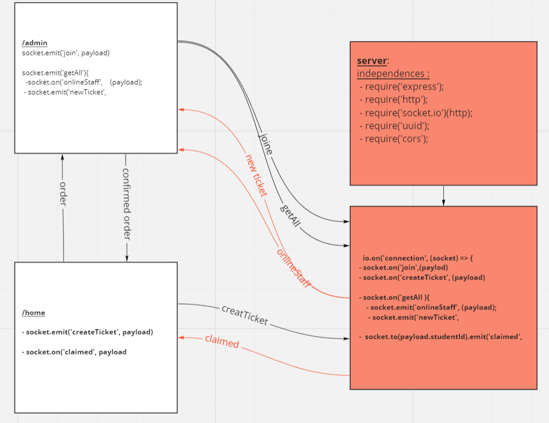

# Project name:

## Delivery App

## Description:

Deleviry app is an app to order coffee from a coffee house. You can specify your order from the menu then the employees will get your order and confirmed it then the employee that confirmed your order will send you back the price  and the time that would be needed for your order.
all the orders would be saved and the employees delete it.

## Technologies Used to build the application:

#### React.js, node.js , socket io , mongodb, Atlas
#### for deploying : Netlify, Heroku

## Authors:

- **Baraa'h Alomari**
- **Batool Ayyad**

## Links:

- **Netlify**: [delivery-app-bb](https://delivery-app-bb.netlify.app/)

- **Heroku**: [b-delivery-app](https://b-delivery-app.herokuapp.com/)

- **organization:** [delivery-app1](https://github.com/delivery-app1)

## UML:

